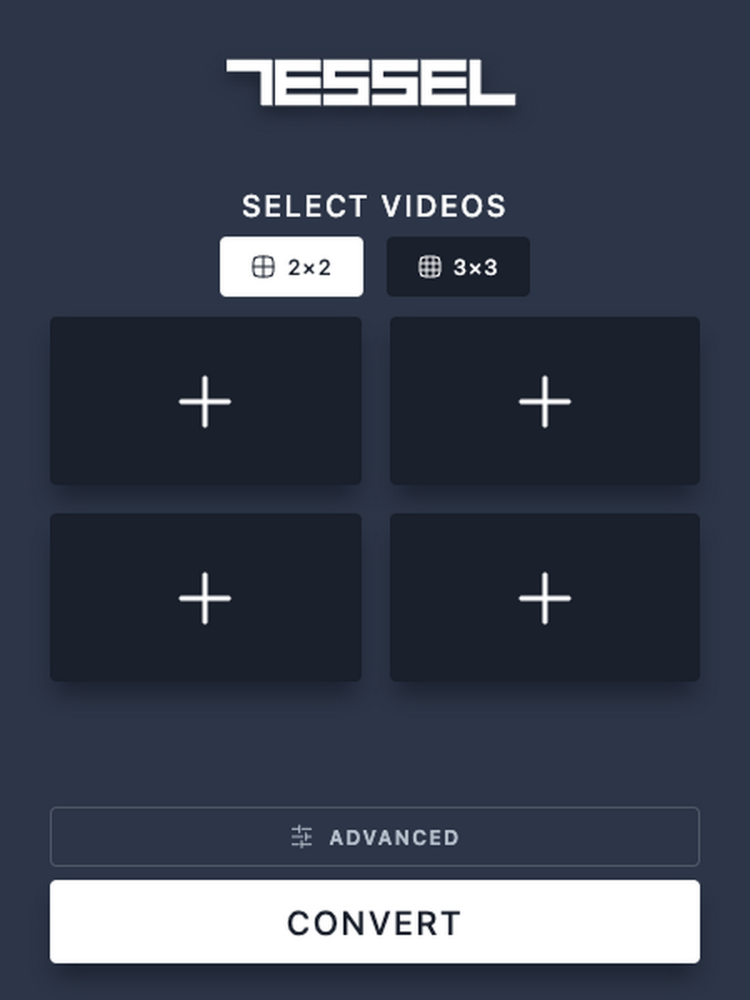
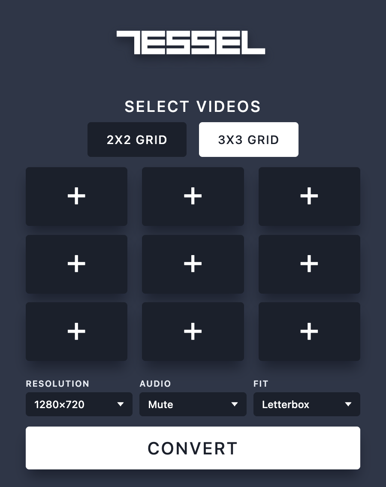

# Tessel

A modern desktop application for creating stunning mosaic videos. Combine multiple video files into beautiful 2x2 or 3x3 grid layouts with real-time progress tracking.

<picture>
  <source media="(prefers-color-scheme: dark)" srcset="assets/logo-light.svg">
  <source media="(prefers-color-scheme: light)" srcset="assets/logo-dark.svg">
  
</picture>

## Screenshots

<table>
  <tr>
    <td></td>
    <td></td>
  </tr>
  <tr>
    <td align="center"><em>2x2 Grid</em></td>
    <td align="center"><em>3x3 Grid</em></td>
  </tr>
</table>

## Features

- **Multiple Grid Layouts**: Create 2×2 or 3×3 video mosaics
- **Flexible Input**: Works with 1–9 videos (empty slots filled with black)
- **Drag & Drop**: Drop one file to fill or replace a slot, or drop several to fill from that cell
- **Clip names**: Filled cells show the file name so you can tell clips apart
- **Output settings**: Choose 1280×720 or 1920×1080, mute or keep audio from the first clip, and letterbox or crop each cell
- **Convert session**: Live progress, cancel an in-progress encode, and keep the grid after success so you can tweak and export again
- **Cross-platform**: macOS (Apple Silicon), Windows, and Linux
- **High Quality Output**: H.264 MP4 mosaic with yuv420p for player compatibility

## Installation

### Download

Download the latest release for your platform from the [Releases page](https://github.com/jamesso/tessel/releases):

- **macOS (Apple Silicon)**: `tessel-macos-arm64.tar.gz`
- **Linux (64-bit)**: `tessel-linux-x64.tar.gz`
- **Windows (64-bit)**: `tessel-windows-x64.zip`

### macOS Installation

⚠️ **Important for macOS users**: Due to Apple's security requirements, you may see a "damaged app" warning. This is normal for apps not distributed through the App Store.

**To install safely:**

1. Extract the downloaded archive
2. **Right-click** on `Tessel.app` and select "Open" (don't double-click)
3. Click "Open" when prompted about the unidentified developer

**Alternative method:**
```bash
# Remove quarantine attribute
xattr -dr com.apple.quarantine /path/to/Tessel.app
```

### Windows & Linux Installation

1. Extract the downloaded archive
2. Run the Tessel executable

## Usage

1. **Select Grid Layout**: Choose 2×2 or 3×3 with the toggle buttons
2. **Add Videos**:
   - Drag and drop onto a cell (one file replaces that slot; several fill consecutive empty slots)
   - Or click a cell to browse (MP4, MOV, M4V, WebM, AVI, MKV)
3. **Output settings**: Pick resolution, whether to mute or use the first clip’s audio, and letterbox vs crop
4. **Convert**: Click Convert and choose where to save the mosaic
5. **Progress**: Watch the percentage. Cancel if you need to stop. On success the grid stays filled so you can export again

### Supported Video Formats

- MP4 (recommended)
- MOV
- M4V
- WebM
- AVI
- MKV
- And other formats supported by FFmpeg

## Technical Details

- **Built with**: Electron 44.x
- **Video Processing**: Bundled FFmpeg 6.x (`ffmpeg-static`) via spawn (`-nostdin`)
- **Architecture**: Context isolation, sandboxed preload (no Node `require` of app modules), asar package with ffmpeg unpacked
- **Output Format**: MP4, H.264 (`veryfast`), 25 fps, yuv420p
- **Resolution**: 1280×720 or 1920×1080 (selectable)
- **Tests**: `npm test` (`node --test`)

## Development

### Prerequisites

- Node.js 22.12 or later
- npm

### Setup

```bash
# Clone the repository
git clone https://github.com/jamesso/tessel.git
cd tessel

# Install dependencies (also runs prepare → sets git hooksPath to scripts/githooks)
npm install

# Run in development mode (nodemon + Electron; restarts on .js, .json, .html, and .css changes; ignores test/). Developer → Reload is also available when running unpackaged.
npm run dev

# Run the app once without nodemon (unpackaged Electron — not a distributable build)
npm start

# Unit tests (node:test)
npm test
```

For **production / distributable** binaries, use the packager scripts in [Building Releases](#building-releases) below (`npm run package-mac`, `package-win`, or `package-linux`).

### Cutting a GitHub Release

1. Bump `"version"` in `package.json` (and `package-lock.json`). The About page reads `app.getVersion()`, so it matches that bump.
2. Push the commit to `master` or `main`. CI creates a GitHub Release when `package.json`’s version has no existing `v$version` release yet — releases are published from **push**, not from pull requests.
3. CI builds macOS, Linux, and Windows assets and uploads them to the [Releases page](https://github.com/jamesso/tessel/releases).

**workflow_dispatch** on the release workflow runs the same packager matrix and uploads build artifacts for smoke-testing; it does **not** create a GitHub Release.

Local `npm run package-*` commands produce **unsigned** binaries in `release-builds/` only (gitignored). Use them to smoke-test packaging; they are not uploaded automatically.

### Building Releases

```bash
# Build for macOS (ARM64)
npm run package-mac

# Build for Windows (x64)
npm run package-win

# Build for Linux (x64)
npm run package-linux
```

### Project Structure

```
tessel/
├── .github/
│   └── workflows/         # CI: test always; pack + GitHub Release on version bump push
├── app/                   # Renderer (HTML, CSS, JS)
├── lib/                   # Mosaic, duration, media-accept helpers (main + tests)
├── test/                  # node:test suite
├── assets/                # Icons, logos, and screenshots
├── scripts/
│   └── githooks/          # commit-msg hook (strips AI co-author trailers)
├── main.js                # Electron main process
├── preload.js             # IPC bridge (no relative CommonJS requires)
└── package.json           # Dependencies and scripts
```

## Contributing

1. Fork the repository
2. Create a feature branch (`git checkout -b feature/amazing-feature`)
3. Commit your changes (`git commit -m 'Add amazing feature'`)
4. Push to the branch (`git push origin feature/amazing-feature`)
5. Open a Pull Request

## License

Tessel application source code is licensed under the [MIT License](LICENSE).

Release builds bundle a copy of [FFmpeg](https://ffmpeg.org/) from the
`ffmpeg-static` npm package. That binary is **not** MIT-licensed; see
[NOTICE](NOTICE) for the MIT/GPL split and where to find FFmpeg's license text.

## Acknowledgments

- Built with [Electron](https://www.electronjs.org/)
- Video processing powered by [FFmpeg](https://ffmpeg.org/)
- UI components styled with modern CSS Grid and Flexbox

## Support

If you encounter any issues or have questions:

1. Check the [Issues page](https://github.com/jamesso/tessel/issues) for existing solutions
2. Create a new issue with detailed information about your problem
3. Include your operating system, app version, and steps to reproduce

---

**Tessel** - Transform your videos into beautiful mosaics ✨