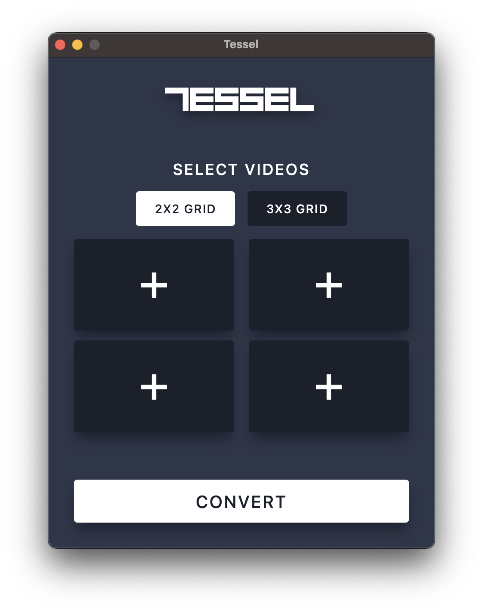

# Tessel

A modern desktop application for creating stunning mosaic videos. Combine multiple video files into beautiful 2x2 or 3x3 grid layouts with real-time progress tracking.

<picture>
  <source media="(prefers-color-scheme: dark)" srcset="assets/logo-light.svg">
  <source media="(prefers-color-scheme: light)" srcset="assets/logo-dark.svg">
  
</picture>

## Screenshots

<div style="display: flex; gap: 20px;">
  <div>
    
    <p align="center"><em>2x2 Grid</em></p>
  </div>
  <div>
    
    <p align="center"><em>3x3 Grid</em></p>
  </div>
</div>

## Features

- **Multiple Grid Layouts**: Create 2x2 or 3x3 video mosaics
- **Flexible Input**: Works with 1-9 videos (missing slots filled with black)
- **Drag & Drop Support**: Easy file selection with drag and drop interface
- **Real-time Progress**: Live conversion progress with percentage display
- **Cross-platform**: Available for macOS, Windows, and Linux
- **Modern UI**: Clean, intuitive interface with visual feedback
- **High Quality Output**: Maintains video quality in mosaic format

## Installation

### Download

Download the latest release for your platform from the [Releases page](https://github.com/jamesso/tessel/releases):

- **macOS (Apple Silicon)**: `tessel-macos-arm64.tar.gz`
- **Linux (64-bit)**: `tessel-linux-x64.tar.gz`
- **Windows (64-bit)**: `tessel-windows-x64.zip`

### macOS Installation

⚠️ **Important for macOS users**: Due to Apple's security requirements, you may see a "damaged app" warning. This is normal for apps not distributed through the App Store.

**To install safely:**

1. Extract the downloaded archive
2. **Right-click** on `Tessel.app` and select "Open" (don't double-click)
3. Click "Open" when prompted about the unidentified developer

**Alternative method:**
```bash
# Remove quarantine attribute
xattr -dr com.apple.quarantine /path/to/Tessel.app
```

### Windows & Linux Installation

1. Extract the downloaded archive
2. Run the Tessel executable

## Usage

1. **Select Grid Layout**: Choose between 2x2 or 3x3 grid using the toggle buttons
2. **Add Videos**: 
   - Drag and drop video files onto the grid squares
   - Or click on squares to browse and select files
   - Supports MP4 and other common video formats
3. **Arrange Layout**: Videos will be positioned in the order you add them
4. **Convert**: Click the "Convert" button and choose where to save your mosaic video
5. **Monitor Progress**: Watch real-time conversion progress with percentage display

### Supported Video Formats

- MP4 (recommended)
- MOV
- AVI
- And other formats supported by FFmpeg

## Technical Details

- **Built with**: Electron 37.1.0
- **Video Processing**: FFmpeg with fluent-ffmpeg
- **Architecture**: Modern Electron with context isolation and security best practices
- **Output Format**: MP4 with H.264 encoding at 25fps
- **Resolution**: 1280x720 output resolution

## Development

### Prerequisites

- Node.js 18 or later
- npm

### Setup

```bash
# Clone the repository
git clone https://github.com/jamesso/tessel.git
cd tessel

# Install dependencies
npm install

# Run in development mode
npm run dev

# Build for production
npm start
```

### Building Releases

```bash
# Build for macOS (ARM64)
npm run package-mac

# Build for Windows (x64)
npm run package-win

# Build for Linux (x64)
npm run package-linux
```

### Project Structure

```
tessel/
├── app/                    # Frontend application
│   ├── index.html         # Main UI
│   ├── about.html         # About page
│   ├── css/               # Stylesheets
│   └── js/                # Frontend JavaScript
├── assets/                # Application icons
├── main.js                # Electron main process
├── preload.js             # Preload script for security
└── package.json           # Dependencies and scripts
```

## Contributing

1. Fork the repository
2. Create a feature branch (`git checkout -b feature/amazing-feature`)
3. Commit your changes (`git commit -m 'Add amazing feature'`)
4. Push to the branch (`git push origin feature/amazing-feature`)
5. Open a Pull Request

## License

This project is licensed under the MIT License - see the [LICENSE](LICENSE) file for details.

## Acknowledgments

- Built with [Electron](https://www.electronjs.org/)
- Video processing powered by [FFmpeg](https://ffmpeg.org/)
- UI components styled with modern CSS Grid and Flexbox

## Support

If you encounter any issues or have questions:

1. Check the [Issues page](https://github.com/jamesso/tessel/issues) for existing solutions
2. Create a new issue with detailed information about your problem
3. Include your operating system, app version, and steps to reproduce

---

**Tessel** - Transform your videos into beautiful mosaics ✨